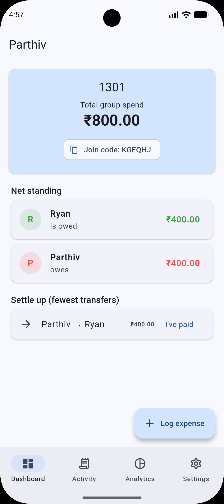

# FinSplit 

**Frictionless, local-first-feeling peer expense tracker for students.**

Split rides, food, subscriptions, and printout costs with your friends — no
account, no phone number, no email. Just create a group, share a 6-character
code, and everyone's synced in real time.

---

## Features

- **Zero-friction groups** — create a group or join one with a short code.
  No signup, no phone number (anonymous auth handles device identity behind
  the scenes).
- **Three ways to split a bill**
  - **Equal** — splits evenly, with exact remainder handling so shares always
    add up to the total, down to the paisa.
  - **Custom amounts** — assign exact amounts per person, with a live
    "unallocated" counter as you type.
  - **Ratio / percentage** — split by percentage, verified against a 100% cap.
- **Multi-payer support** — log a bill that multiple people chipped in for
  upfront, not just one payer.
- **Live sync across devices** — log an expense on one phone, see it appear
  on everyone else's dashboard within seconds.
- **Smart settle-up** — a debt-simplification algorithm collapses everyone's
  balances into the *fewest possible transfers* needed to settle up.
- **Two-step settlement confirmation** — the person who owes taps "I've
  paid," and the person who's owed has to confirm before it actually clears
  the balance. No more "trust me, I paid you."
- **Spend analytics** — category breakdown and monthly trend charts.
- **Swipe-to-delete** with undo, for when you log something by mistake.
- **Light & dark mode**, saved automatically.
- **Delete a group entirely** whenever you're done with it — wipes every
  expense, settlement, and participant for everyone.

---

## Screenshots

| Onboarding | Dashboard | Add Expense |
|:---:|:---:|:---:|
|  |  |  |

| Dashboard (settled) | Settlement confirmation | Activity Log |
|:---:|:---:|:---:|
|  |  |  |

| Analytics | Settings | Second user's view |
|:---:|:---:|:---:|
|  |  |  |

---

## Tech stack

- **Flutter** (Dart) — cross-platform UI
- **Firebase Firestore** — live, multi-device data sync
- **Firebase Authentication** (anonymous) — frictionless per-device identity
- **Provider** — state management
- **fl_chart** — analytics charts
- **shared_preferences** — remembering which group a device is in, and
  light/dark mode preference

---

## Architecture

```
lib/
  models/       SplitType enum
  services/     FirebaseService (auth), FirestoreService (all group/expense/
                settlement CRUD + live streams), SettlementService (debt
                simplification algorithm)
  providers/    GroupProvider, ExpenseProvider (state + Firestore listeners),
                ThemeProvider
  screens/      Onboarding, Dashboard, Activity, Analytics, Settings,
                AddExpense, Home (nav shell)
  widgets/      BalanceCard, ExpenseTile
  utils/        Validators (input sanitization), SplitCalculator (split math)
```

Firestore structure:
```
groups/{groupId}
  ├─ name, joinCode
  ├─ participants/{uid}       — name, joinedAt
  ├─ expenses/{expenseId}     — title, category, totalAmount, splitType,
  │                             contributions (who paid), shares (who owes)
  └─ settlements/{id}         — fromId, toId, amount, status (pending/confirmed)

joinCodes/{code} → groupId    — fast lookup for joining by code
```

---

## Getting started

### Prerequisites
- [Flutter SDK](https://docs.flutter.dev/get-started/install)
- Android Studio (for the Android SDK + an emulator, or use a physical phone)
- A [Firebase](https://console.firebase.google.com) project with:
  - **Firestore Database** enabled (test mode is fine for development)
  - **Authentication → Anonymous** sign-in enabled

### Setup

```bash
# 1. Clone this repo
git clone https://github.com/<your-username>/finsplit.git
cd finsplit

# 2. Get packages
flutter pub get

# 3. Add your Firebase config
# Download google-services.json from your Firebase project (Project settings
# → your Android app) and place it at:
#   android/app/google-services.json

# 4. Run it
flutter run
```

> **Note:** `android/app/google-services.json` is intentionally left out of
> this repo (see `.gitignore`) since it's project-specific. Each contributor
> needs their own from their Firebase console, or you share one privately if
> collaborating on the same Firebase project.

---

## How the settlement algorithm works

Instead of everyone paying back exactly who they owe for every individual
expense, FinSplit nets out each person's overall balance across *all*
expenses, then greedily matches the largest creditor with the largest debtor,
repeating until everyone's settled. This collapses what could be dozens of
tiny IOUs into the minimum number of transfers needed — a group of 6 people
with tangled debts might only need 2-3 actual payments to fully settle up.

---
